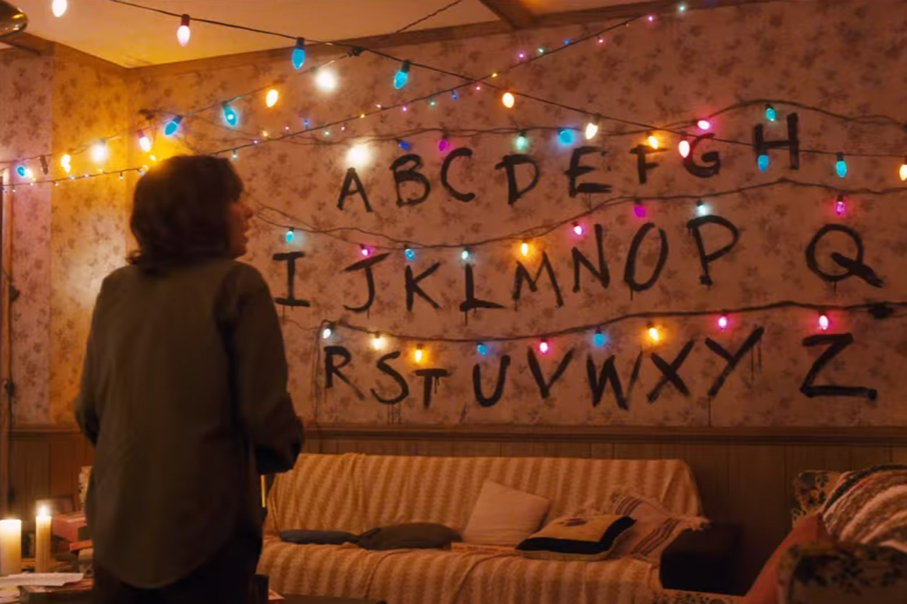

## Stranger Things Chritmas lights with Arduino, esp8266 and FastLED library

  

Perfect Halloween project based on Stranger Things season 1 !

The goal is to reproduced the given image with simple components :

With all the letters placed :

# List of Components : 
- 1 ESP8266 board : I chose a Wemos D1 mini : [AliExpress link](https://bit.ly/2YUypU7)
- 1 WS2811 christmas string lights (50 pcs) : [Ebay link](https://ebay.to/2JLSQfw)
- 5m (2.5m needed) 3-Pin 22AWG Extension Connector Wire Cable [Ebay link](https://bit.ly/349J3cH)
- The Arduino IDE : [Official Link](https://www.arduino.cc/en/Main/Software)
- The FastLED library : [GitHub link](https://github.com/FastLED/FastLED/releases)
- Case BONUS : a jack to cassette tape adapter : [AliExpress link](https://bit.ly/2xNdh6j)

# The wiring
I used the cassette tape adapter to fit my Wemos D1 mini and used the Jack wire for the string data.

# How to customize the lights
1. Power up the Wemos D1 mini with a phone charger.
1. Take your phone.
3. Turn off 4G.
4. Choose the Wi-Fi network of the lights. By default its name is "StrangerThingsWall".
5. Enter the password. By default it is "iameleven".
6. Launch your web browser and go to [http://192.168.4.1](http://192.168.4.1).

# 7. ENJOY THIS!

# More photos

Check out the folder [ExtraPhotos](./ExtraPhotos/) for extra photos of the inside of the beast